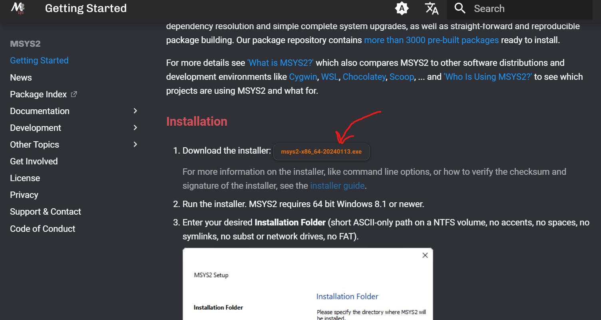
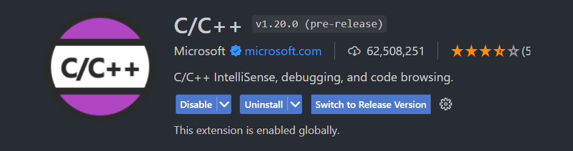
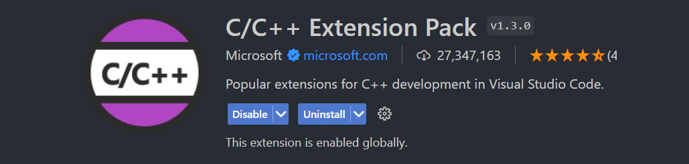
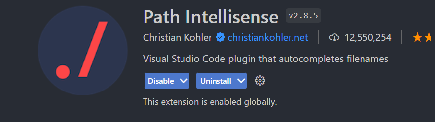
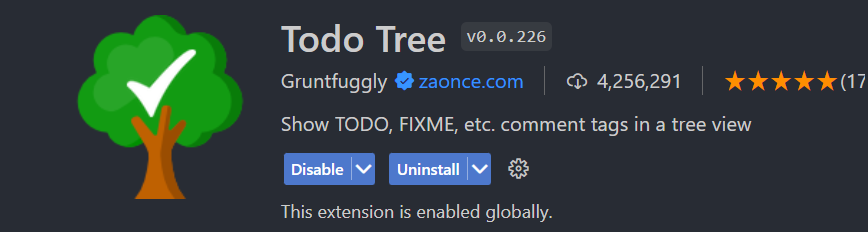
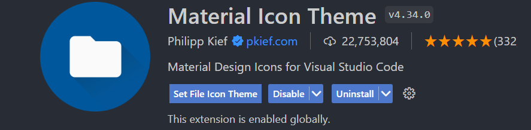

# Alce Engine Environment Setup Tutorial

### Table of Contents

1. [Prerequisites](#prerequisites)
2. [Compiler Setup](#step-1-compiler-setup)
3. [Download Alce Engine](#step-2-download-alce-engine)
4. [Setup Development Environment](#step-3-setup-development-environment)

# Prerequisites

Before proceeding, you must meet the following requirements to complete this tutorial:

* Operating System: Windows 10-11 64 bit; we do not provide support for earlier versions.

As of now, Alce Engine is primarily focused on the Windows environment. However, we intend to expand the engine's usage to Mac and Linux platforms in the future.

# Step 1: Compiler Setup

In order to compile the project along with the Alce Engine CLI, you'll need the GCC 13.1.0 MinGW 32-bit compiler. There are several ways to install it, but in this tutorial, we'll use MSYS2, as this tool greatly simplifies the process.

Start by installing MSYS2 following the instructions on its [website](https://www.msys2.org/). 




Once the program is installed, launch it and run the following command within the integrated terminal:

```bash
$ pacman -S mingw-w64-i686-toolchain
```

After the installation is complete, navigate to your local folder "<i>C:\msys64</i>" and locate the mingw32 folder and its subfolder bin. Ensure it's not empty and contains the following files:

```bash
C:/msys64
    |-> mingw32
    |    |-> bin
    |    |    |-> (...)
    |    |    |-> g++.exe
    |    |    |-> gdb.exe
    |    |    |-> mingw32-make.exe
```

Copy the path of the folder "<i>C:\msys64\mingw32\bin</i>" and open the system variable editor.

The easiest way to do this is by typing "environment variable" into your Windows Search bar and clicking “Edit the system environment variables.”


Once you’re in the “Advanced” tab, click on “Environment Variables...”


In the "System Variables" section, select the "Path" variable and click "Edit."


A new tab will open, click on "New" and paste the path.

 

Once the changes are saved, open a new terminal (if you had one open before the previous process, close it as it may not yet recognize the commands) and run the following commands to verify the correct installation of the compiler:

```bash
g++ --version
mingw32-make --version
gdb --version
```

If you didn't receive an error message indicating that the command is not recognized in all three commands, congratulations, you have successfully installed the compiler. The toughest part of this tutorial is now behind you! :smile:

# Step 2: Download Alce Engine

Once the compiler is installed, everything is ready to start using the engine.

However, it's crucial to understand before moving forward: Alce Engine isn't a traditional installable software. Instead, to develop projects with this engine, you must obtain the source code from its repository by cloning or downloading it. This repository contains not only the source code but also the necessary compilation tools. This approach offers flexibility and streamlines the compilation process. Unlike traditional methods using CMake, Alce Engine utilizes a custom CLI programmed in Python specifically tailored to handle compilation and project building, enhancing usability to the fullest extent possible.

Having direct access to the engine's source code allows users the freedom to modify it according to their preferences, adding components, or even expanding its core functionality. While this decision may slightly increase compilation time for larger projects, it significantly reduces common linking issues often encountered in C++ development.

Now that we understand this, let's proceed to download the engine's repository. If you have Git installed, simply clone the repository using the following command:

```bash
git clone https://github.com/gabrielbeguren/AlceEngine
```

If, on the other hand, you don't have Git installed (though we highly recommend it), you can also download the source code as a zip file from the GitHub interface.


# Step 3: Setup Development Environment

Now that the compiler is installed and you have a copy of the project, it's time to start coding!

Arriving at this step, it's important to clarify that this is entirely optional but recommended if you want to comfortably develop your project with the engine.

Firstly, you'll need to download an IDE to write your code. We won't delve into pointless debates about which editor is better or worse; they all serve their purpose. In this tutorial, we'll use the popular and exceptionally dynamic code editor Visual Studio Code. If you're comfortable with another editor such as Vim or even Notepad, feel free to use it.

Download the editor from its [website](https://code.visualstudio.com).

Once installed, you could start coding, but there's still room to enhance the user experience. To do this, we'll install a series of extensions that will make our work easier.

To begin, open Visual Studio Code and navigate to the left margin of the window. Click on the following icon.

<center>
    
</center>

Once the extensions bar is open, we'll install the following extensions:

Una vez abierta la barra de extensiones, vamos a instalar las siguientes extensiones:

### C/C++ and C/C++ Extension Pack


<hr>



These extensions are probably the most important ones as they provide IntelliSense for C++, essential for developing under optimal conditions and anticipating errors.

It also provides the ability to execute code from a small button located at the top right of the window. We won't use this button to compile/execute our project; instead, we'll use the Alce CLI from a command line.

### Path Intellisense



This extension facilitates handling paths for any programming language thanks to its IntelliSense specifically dedicated to this task.

### Todo Tree




This extension is very useful for visualizing all the TODO comments in our project in a small diagram. If you're not aware, it's quite common to use these comments in software development to indicate pending tasks or sections awaiting review. If your project is of significant size, it's quite likely that you'll end up with dozens of these comments and consequently forget about them. This extension is quite useful for keeping your code up to date!

### Material Icon Theme




This extension provides dedicated icons in the navigation bar. It doesn't affect the code itself, but it does facilitate the visualization of the project structure in that bar. Consider using this extension not only for your Alce Engine projects but also for any other external projects: Angular, React, Unity, etc.

# Conclusion

At this point, you'll have everything ready to start developing your incredible game with Alce Engine!