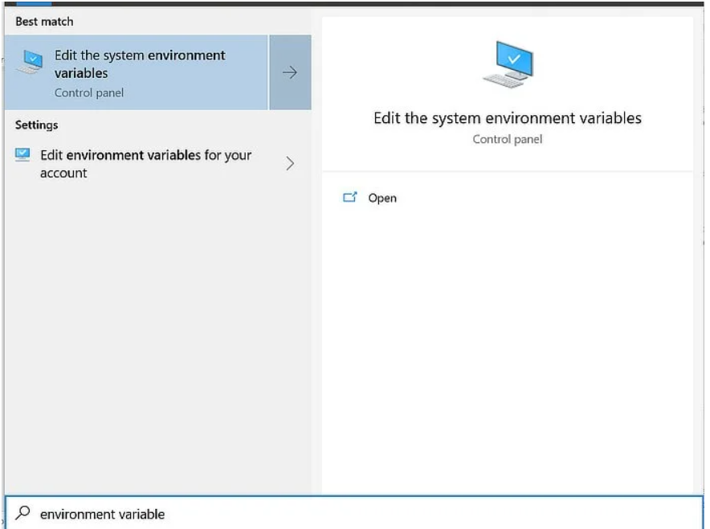
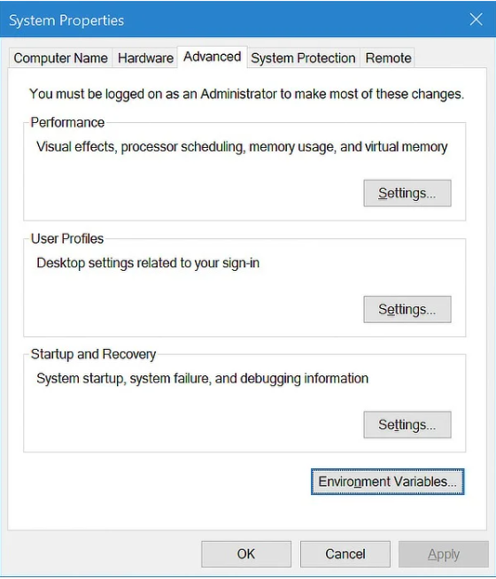
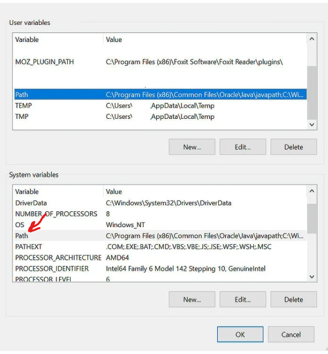
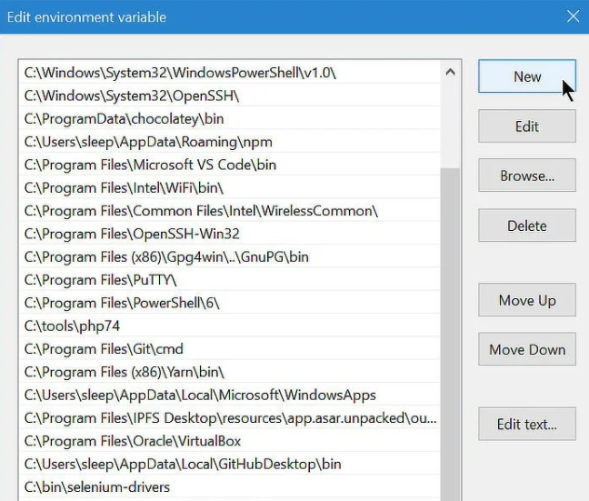
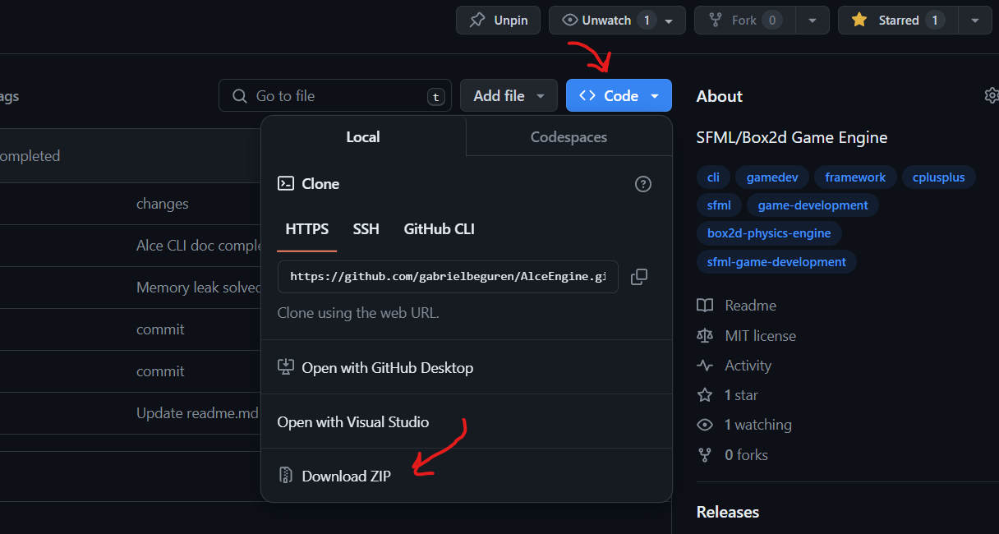

# Alce Engine Environment Setup Tutorial

### Table of Contents

1. [Compiler Setup](#Step-1:-Compiler-Setup)
2. [Download Alce Engine](#Step-2:-Download-Alce-Engine)

# Step 1: Compiler Setup

In order to compile the project along with the Alce Engine CLI, you'll need the GCC 13.1.0 MinGW 32-bit compiler. There are several ways to install it, but in this tutorial, we'll use MSYS2, as this tool greatly simplifies the process.

Start by installing MSYS2 following the instructions on its [website](https://www.msys2.org/). Once the program is installed, launch it and run the following commands within the integrated terminal:

```bash
$ pacman -S mingw-w64-i686-toolchain
```

After the installation is complete, navigate to your local folder "<i>C:\msys64</i>" and locate the mingw32 folder and its subfolder bin. Ensure it's not empty and contains the following files:

```bash
C:/msys64
    |-> mingw32
    |    |-> bin
    |    |    |-> (...)
    |    |    |-> g++.exe
    |    |    |-> gdb.exe
    |    |    |-> mingw32-make.exe
```

Copy the path of the folder "<i>C:\msys64\mingw32\bin</i>" and open the system variable editor.

The easiest way to do this is by typing "environment variable" into your Windows Search bar and clicking “Edit the system environment variables.”



Once you’re in the “Advanced” tab, click on “Environment Variables...”



In the "System Variables" section, select the "Path" variable and click "Edit."



A new tab will open, click on "New" and paste the path.

 

Once the changes are saved, open a new terminal (if you had one open before the previous process, close it as it may not yet recognize the commands) and run the following commands to verify the correct installation of the compiler:

```bash
g++ --version
mingw32-make --version
gdb --version
```

If you didn't receive an error message indicating that the command is not recognized in all three commands, congratulations, you have successfully installed the compiler. The toughest part of this tutorial is now behind you! :smile:

# Step 2: Download Alce Engine

Once the compiler is installed, everything is ready to start using the engine.

However, it's important to clarify something before proceeding. Alce Engine is not an installable software per se. For each project you wish to develop using this engine, you'll need to clone or download the source code from the engine's repository. Within the repository, you'll find both the source code and the compilation tools. This design choice aims for versatility and simplification of the compilation process (Alce Engine doesn't use CMake; instead, the CLI programmed in Python handles the compilation and project building).

Now that we understand this, let's proceed to download the engine's repository. If you have Git installed, simply clone the repository using the following command:

```bash
git clone https://github.com/gabrielbeguren/AlceEngine
```

If, on the other hand, you don't have Git installed (though we highly recommend it), you can also download the source code as a zip file from the GitHub interface.


